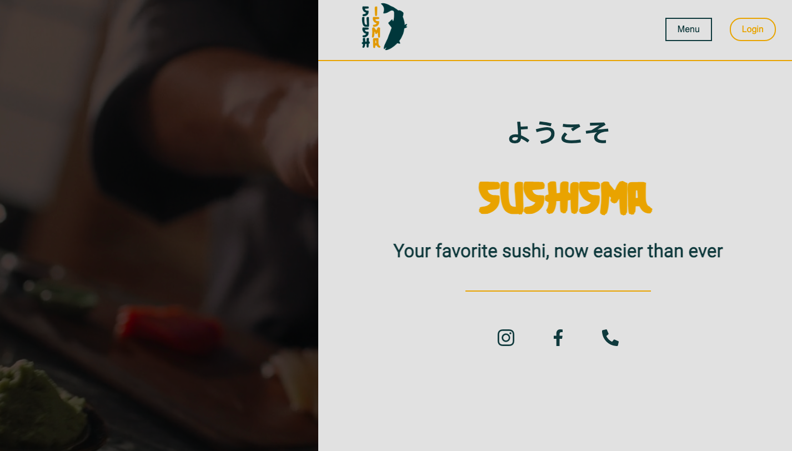
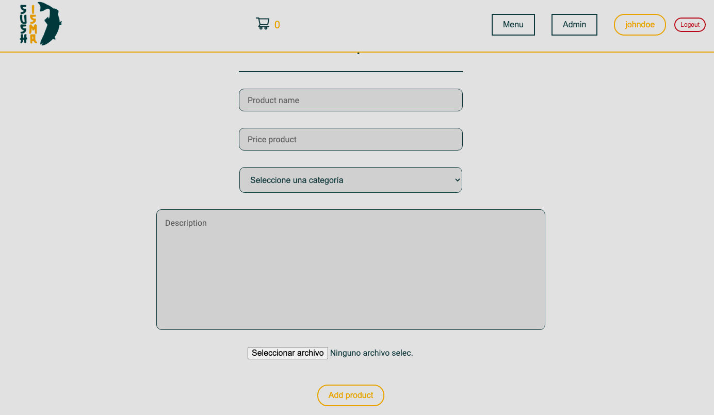

# 🍱 Sushisma - React 

Welcome to Sushisma! The project that will bring the delicious world of sushi directly to your doorstep.

Sushisma is a sushi delivery business concept that aims to offer our customers a unique and convenient Japanese gastronomic experience.

---
## Technologies used ⚙️

* HTML: HyperText Markup Language is the standard markup language for creating web pages and web applications.

* CSS: Cascading Style Sheets is a style sheet language used for describing the look and formatting of a document written in HTML.

* JavaScript: A high-level programming language that enables interactivity and dynamic functionality on web pages.
React: A JavaScript library for building user interfaces, commonly used for creating dynamic and interactive web applications.

* Vite: A build tool and development server that is designed to be fast and efficient for modern web development, often used with React for quick project setup and development.

* Context: A feature in React that allows for global state management and sharing data across components without the need for prop drilling.

* Sass: A CSS preprocessor that extends the capabilities of CSS by providing features like variables, nesting, mixins, and more, making CSS code more modular and maintainable.

We have worked on a SQL database implemented with Express and Sequelize.

https://github.com/amsiceza/TBridge-Ecommerce-Project

---
## Color palette 🎨
At Sushisma, we have carefully selected a vibrant and visually appealing color palette to enhance the aesthetics of our website. The colors we have chosen reflect the essence of Japanese culture and the freshness of our sushi.
```
#1c393c, #e0a213, #e1e1e1
```


---
## Styles 🖍
Sass is a CSS preprocessor that allows developers to write styles in a more efficient and modular way. With Sass, you can use variables, functions, loops, and other advanced features that are not available in native CSS. This makes the process of writing and maintaining styles much easier and more efficient.

By styling all the styles in Sass without using any framework, you can push the limits of what is possible with Sass and native CSS. This can be a challenging task as it involves writing all the style rules from scratch instead of using pre-defined classes and styles provided by frameworks.

However, by doing it this way, you can have greater control over the styles and ensure they are exactly what you want, rather than being limited by the options provided in a framework. Additionally, it can result in lighter and faster code as you're not loading any additional framework.

---
## Views and options 📺

We have also paid special attention to navigation and usability in each view of our website. We have created intuitive menus that allow visitors to easily navigate between different sections of our website, and we have ensured that the views are responsive and adapt to different devices and screen sizes.

Overall, our website is designed to provide an exceptional user experience and enable visitors to find the information they need effortlessly. We hope you enjoy exploring the different views of our website and feel inspired by the design and functionality we have created.

---
### Home 🏠
---
The homepage of our website features a clean and straightforward design, focusing on delivering a clear and concise user experience. We have carefully curated the content to ensure that it provides all the essential information without overwhelming the user with excessive visual elements.

Multimedia files such as images and videos have been strategically incorporated to vividly depict the essence of Sushisma and what we offer. These visuals effectively convey the quality, variety, and uniqueness of our products and services.

Our navigation menus have been thoughtfully designed to be minimalistic, offering only the necessary options for users to explore our products. We understand the importance of simplicity and ease of use, allowing visitors to quickly access the sections they are interested in without any unnecessary distractions.

Furthermore, we have implemented a registration and login system to unlock additional functionalities. Once registered and logged in, users gain access to exclusive features and personalized experiences tailored to their preferences. This ensures a more customized and engaging experience, allowing users to take full advantage of what Sushisma has to offer.



---
### Menu sushi 🍣
---
Here, you will find a wide range of items that you can add to your shopping cart. Please note that access to the cart view is exclusive to registered customers. If you haven't logged in yet, please take a moment to create an account or sign in to explore our products and make purchases.

Below, you will find a variety of products, each accompanied by a brief description of its contents. We believe in providing you with as much information as possible to help you make informed decisions about your purchases. Additionally, you will find the price of each item displayed alongside an "Add to Cart" button.


---
### Admin view 👤
---
We have an admin view that resembles the menu view but includes additional functionality exclusively for administrators. In this admin view, administrators have access to an "Add Product" button on each card, allowing them to add new products to the menu. Additionally, there is a "Delete Product" button on each card, giving administrators the ability to remove products from the menu.

It's important to note that these admin privileges are only granted to authorized administrators. If you are not an admin, you will not have access to these additional features. The purpose of this restricted access is to maintain control and ensure that only authorized individuals can manage and modify the menu.



---
### Cart 🛒
---
We have implemented a shopping cart feature that allows you to add products to your cart and view a summary of your purchase. Each product you add to the cart will be displayed along with its price and quantity.

Once you have added products to your cart, you will see a summary section that provides a breakdown of your purchase. This summary includes the total price of the sushi products you have selected. Additionally, it includes a shipping fee, if applicable, and a grand total that combines the price of the products and the shipping fee.

To proceed with your purchase, you will find a "Checkout" button. Clicking on this button will take you to the payment and order confirmation process. We have designed this process to be smooth and secure, ensuring that your purchase is completed seamlessly.

If, for any reason, you decide to clear your cart and start over, we have also included a "Clear Cart" button. Clicking on this button will remove all the items from your cart, allowing you to start fresh and add new products as desired.


---
### User profile ⛩
---
The user profile view provides a comprehensive overview of the connected user, including a description or bio section and a list of past orders sorted by date. Each order entry displays the ordered products along with their respective prices and quantities.

In the user description section, you can provide a brief summary or bio about yourself, allowing others to get to know you better. This section offers an opportunity to personalize your profile and share any relevant information or interests.

Below the description, you will find a chronological list of your past orders. Each order entry includes details such as the date and time the order was placed. Additionally, it presents a breakdown of the ordered products, listing each item, its corresponding price, and the quantity that was purchased.


---
### Register / Login 🧑‍🍳
---
To access the full functionalities of our website, including the ability to place orders, we have implemented a login and user registration view.

In the login view, existing users can enter their credentials, such as username or email address, and password to authenticate and gain access to their account. This secure login process ensures that only authorized individuals can access the complete features of our website.

If you are a new user, we provide a user registration view where you can create a new account. This typically involves providing necessary information such as your name, email address, and creating a password. By registering, you will have your own unique account that allows you to explore the website, place orders, and enjoy a personalized experience.


---
## Contributing ⭐
If you want to contribute to this project, don't hesitate to give it a star.

---

## Author 🧑‍💻
* Ismael Cervera - [amsiceza](https://github.com/amsiceza)


